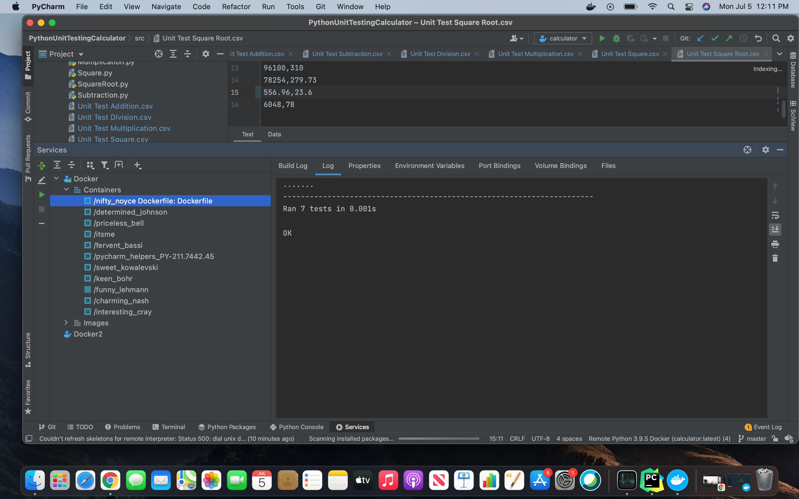
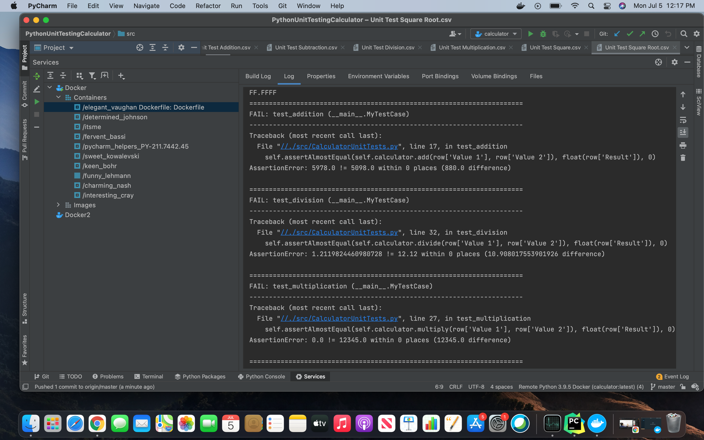
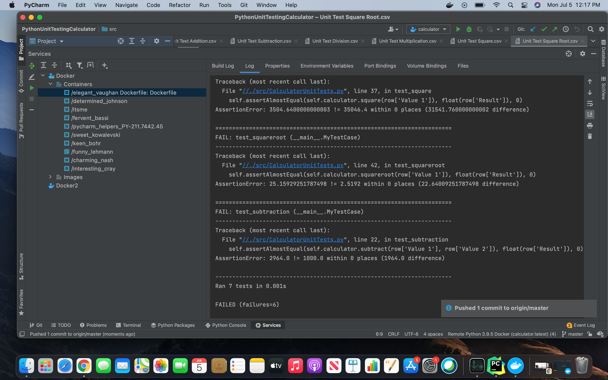

# PythonUnitTestingCalculator

About:

For this project, you need to create a calculator using Python that has automated unit tests.  Your calculator is required to perform the following operations: addition, subtraction, multiplication, division, square, and square root.  You need to correctly use static methods, object methods, object attributes/properties.   You need to use the included files to load data for your unit tests.  Use each file to test the associated operation.

Snapshots:

Notes: 

UseCalaculator module is an extra module that has the code for running the Calculator normally (without Unit Testing). 
